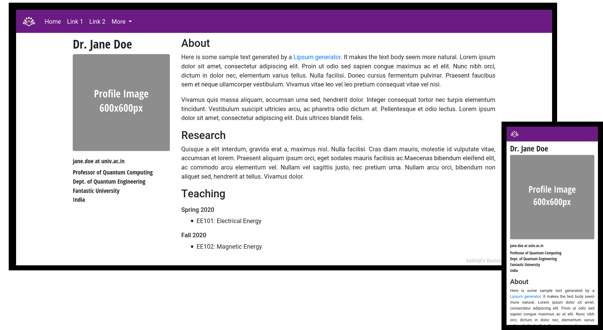

# BootstrapHomepageTemplate

A simple Bootstrap theme template for an academic webpage, themed with IIT Dharwad colours and typography.

Bootstrap is a simple Javascript Library that enables lightweight yet responsive pages that look and feel great on all devices, from small mobile phones to tablets to large desktop displays.

#### Appearance
This is what the template looks like on desktop and mobile:
 

#### Usage

###### Download
Essentially you need to download the code, edit, and copy it into the web directory of your webserver.

To download the code you can click the download button or git-clone the repo. Note that if you are git-cloning over SSH from IITDG-Gitea (which uses a self-signed certificate) you may need to use the following command to clone this repo:
```
git -c http.sslVerify=false clone  https://gitea.iitdh.ac.in:443/kabhijit/BootstrapHomepageTemplate.git
```
###### Modifying
To edit, I recomment the open-source  editor "Brackets" which has a "live-preview" mode, showing the changes as the HTML code is modified. Simple changes can be made by just replacing the sample text blocks in the html file (a rudimentary understanding of HTML is sufficient). For more complex changes to the layout a good understanding of bootstrap may be necessary. Colors and themes are defined in the accompanying css file.

Edits may also be submitted via github's issue tracker / pull requests.

#### Credits
This template was inspired by and based on the simple and elegant bootstrap template [mavroudisv/plain-academic](https://github.com/mavroudisv/plain-academic)

